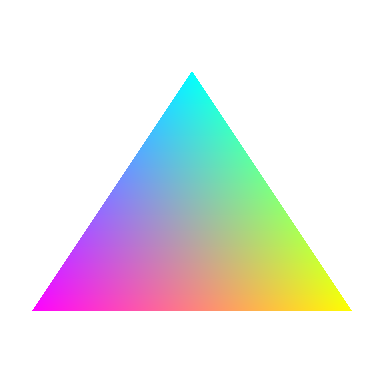

# SharedGL   

SharedGL (SGL) is an OpenGL implementation built upon shared memory, allowing for capturing graphics calls and accelerated graphics within virtual machines. SGL is designed with the intent to be compatible with a wide range of platforms (WGL, GLX, EGL), making it possible to run on virtually any guest system without the need for full GPU passthrough solutions.

> [!IMPORTANT]\
> Functionality is currently limitted as some chunks of the OpenGL standard are yet to be implemented (to check the status on near fully supported versions, scroll down). Additionally, this has only been tested on a handful of demoes (including glxgears) on X11 (GLX) and Windows (WGL) as EGL support has not been implemented yet. If you encounter crashes or weird bugs, scroll down for troubleshooting.

# Getting started

The following libraries are required for building the server and client on linux:
- libepoxy
- SDL2
- libx11

## Build
The following script builds the host and client for linux (currently only x64 is "officially" supported).
```bash
git clone https://github.com/dmaivel/sharedgl.git
cd sharedgl
mkdir build
cd build
cmake ..
cmake --build . --config Release
```

The following script compiles the windows client (this must be done on windows, through the `Visual Studio Developer Command Prompt / Powershell`). For more information regarding the build process for Windows, including building for x86, scroll down.
```bash
git clone https://github.com/dmaivel/sharedgl.git
cd sharedgl
mkdir build
cd build
cmake ..
cmake --build . --target sharedgl-core --config Release
```

# Usage
Regardless of the where the client is being ran, the server must be started before starting any clients (and can only be ran on linux systems).

```bash
usage: sharedgl [-h] [-v] [-o] [-x] [-g MAJOR.MINOR] [-r WIDTHxHEIGHT] [-m SIZE]

options:
    -h                 display help information
    -v                 display virtual machine arguments
    -o                 enables fps overlay on clients (shows server side fps)
    -x                 remove shared memory file
    -g [MAJOR.MINOR]   report specific opengl version (default: 2.1)
    -r [WIDTHxHEIGHT]  set max resolution (default: 1920x1080)
    -m [SIZE]          max amount of megabytes program may allocate (default: 16mib)
```

## Running clients

> [!IMPORTANT]\
> In addition to installing the library, you also need to install a driver and attach a shared memory device if you are using a virtual machine. For more information, scroll down to the virtual machine section.

### Linux
For your OpenGL application to communicate with the server, the client library must be specified in your library path. Upon exporting, any program you run in the terminal where you inputted this command will run with the SGL binary.

```bash
$ export LD_LIBRARY_PATH=$LD_LIBRARY_PATH:/path/to/sharedgl/build
$ glxgears
$ ...
```

### Windows (VM)
There are two ways to install the library on windows (keep scrolling for more information regarding VMs):
1. Use a release
    1. Download the latest release for windows and extract the zip file.
    2. Navigate into the extracted folder and run `wininstall.bat` and allow admin privledges.
    3. The libraries should now be installed, meaning any application that uses OpenGL (32-bit and 64-bit) will use SharedGL.
2. Compile from source (use cmd / powershell / Visual Studio Developer Command Prompt)
    1. Download the source (preferably thru `git`).
    2. Navigate into the folder, create a new folder named `build`, and navigate into it (mkdir `build` && cd `build`).
    3. Run `cmake ..`, which will target the system's architecture.
        - The steps below can be ran after building for another target.
        - To explicitly state an x64 build, run `cmake -DCMAKE_GENERATOR_PLATFORM=x64 ..` instead.
        - To explicitly state an x86 (32-bit) build, run `cmake -DCMAKE_GENERATOR_PLATFORM=Win32 ..` instead.
    4. Upon building either the x64 binary or x86 binary or both binaries, move the install script (`...\sharedgl\scripts\wininstall.bat`) into the same folder where the built binaries reside (`...\sharedgl\build\Release\`).
    5. Run the script and allow admin privledges.
    6. The libraries should now be installed, meaning any application that uses OpenGL (32-bit and 64-bit) will use SharedGL.

An uninstall script, `winuninstall.bat` is also provided.

> [!NOTE]\
> Previous releases' clients are named opengl32.dll, meaning they are not ICDs. If you use a client from release <= 0.3.0, then all you need to do is drop it into the same folder as your OpenGL application. It is not recommended that you use the clients from these releases as they become outdated and are not reliable.

### Environment variables
When running clients, a user may specify one or more of the following environment variables for version control:
```
GL_VERSION_OVERRIDE=X.X
GLX_VERSION_OVERRIDE=X.X
GLSL_VERSION_OVERRIDE=X.X
```

# Virtual machines
Before you start up your virtual machine, you must pass a shared memory device and start the server before starting the virtual machine. This can be done within libvirt's XML editor or the command line. Use the `-v` command line argument when starting the server and place the output in its respective location, depending on whether you use libvirt or qemu. Scroll down for driver information.

**libvirt:**
```xml
<!--> THIS IS A SAMPLE; ONLY USE THIS AS A GUIDE ON WHERE TO PLACE THE OUTPUT <-->
...
<devices>
    ...
    <shmem name="sharedgl_shared_memory">
        <model type="ivshmem-plain"/>
        <size unit="M">??</size>
    </shmem>
</devices>
```

**qemu:**
```bash
# THIS IS A SAMPLE; ONLY USE THIS AS A GUIDE ON WHERE TO PLACE THE OUTPUT
qemu-system-x86_64 -object memory-backend-file,size=??M,share,mem-path=/dev/shm/sharedgl_shared_memory,id=sharedgl_shared_memory
```

> [!WARNING]\
> If you move the client library to the guest from the host instead of compiling it in the guest, you may encounter the `SIGILL` exception in the virtual machine as the build compiles with the native (host) architecture. To fix, either change your cpu model to `host-model`/`host-passthrough` or comment out the `-march=native` line in the cmake script (will most likely reduce performance).

## Linux
For virtual linux clients, an additional kernel module needs to be compiled. The compiled result, `sharedgl.ko`, needs to be moved into the guest, and loaded. There is an `install.sh` script within this directory which may be moved alongside the module for ease of use. It is recommended that you add `sharedgl` to your modprobe config following installation, otherwise it must be loaded manually on each boot.
```bash
# within 'sharedgl' directory
cd kernel
make
```

Additionally, `libGL.so.1` needs to be moved into the guest for library loading.

## Windows
For windows clients, the Windows VirtIO Drivers need to be installed, which can be found [here](https://fedorapeople.org/groups/virt/virtio-win/direct-downloads/upstream-virtio/). (Navigate to `...\virtio-win-upstream\Win10\amd64\`, right click on `ivshmem.inf`, and press `Install`).

# Supported GL versions
This list describes the amount of functions left from each standard to implement. This excludes EXT/ARB functions. This list may be inaccurate in terms of totals and also counts stubs as implementations.

- [x] OpenGL 1
    - [x] 1.0 (~306 total)
    - [x] 1.1 (~30 total) 
    - [x] 1.2 (~4 total) 
    - [x] 1.3 (~46 total) 
    - [x] 1.4 (~47 total) 
    - [x] 1.5 (~19 total) 
- [x] OpenGL 2
    - [x] 2.0 (~93 total) 
    - [x] 2.1 (~6 total) 
- [ ] OpenGL 3
    - [ ] 3.0 (~26 remaining) (~84 total) 
    - [ ] 3.1 (~7 remaining) (~15 total) 
    - [ ] 3.2 (~14 remaining) (~19 total) 
    - [ ] 3.3 (~29 remaining) (~58 total) 
- [ ] OpenGL 4
    - [ ] 4.0 (~24 remaining) (~46 total) 
    - [ ] 4.1 (~36 remaining) (~89 total) 
    - [ ] 4.2 (~4 remaining) (~12 total) 
    - [ ] 4.3 (~24 remaining) (~44 total) 
    - [ ] 4.4 (~8 remaining) (~9 total) 
    - [ ] 4.5 (~51 remaining) (~122 total) 
    - [x] 4.6 (~4 total) 

# Limitations / Issues
- Server can only handle a single client at a time
- Missing many GL functions
- Vsync does not work
- Resizing is not handled
- Windows guests rendering is janky and prone to crashing
- Inaccurate FPS in overlay (to-do: move timings from server to client)
- GLFW cant request OpenGL profiles

# Troubleshooting
You may encounter weird crashes/faults/errors such as `IOT instruction` or `No provider of glXXX found.`. Although the code base is buggy, these are some tips to try to further attempts to get an application to work:
- Change the GL version (i.e `-g 2.0`)
- Allocate more memory (i.e `-m 256`)

Application shows a blank window in the virtual machine?
- Make sure the shared memory device passes through all the memory (check the size)

Application doesn't run in the virtual machine? (Process exists but stalls)
- Make sure the server is running
    - If you start the server and it still won't run, shut down the VM, run `sudo ./sharedgl -x`, start the server, start the VM
- Make sure the drivers are installed (VirtIO IVSHMEM for Windows, custom kernel must be compiled for linux)

# Showcase

<details>
<summary>Click to reveal: Running minetest in a windows virtual machine</summary>

https://github.com/dmaivel/sharedgl/assets/38770072/26c6216d-72f7-45b4-9c4f-1734de0d1c6d

</details>

<details>
<summary>Click to reveal: Running glxgears in a windows virtual machine (outdated)</summary>
    
https://github.com/dmaivel/sharedgl/assets/38770072/a774db97-807e-46b9-a453-fa2ee3f4ea84

</details>

<details>
<summary>Click to reveal: Running glxgears in a linux virtual machine (outdated)</summary>

https://github.com/dmaivel/sharedgl/assets/38770072/0d46bf46-5693-4842-a81f-2f186c396e26

</details>

<details>
<summary>Click to reveal: Running a compute shader in a linux virtual machine (outdated)</summary>
    
https://github.com/dmaivel/sharedgl/assets/38770072/ded179b8-23dc-491d-ba34-4108e014f296

</details>